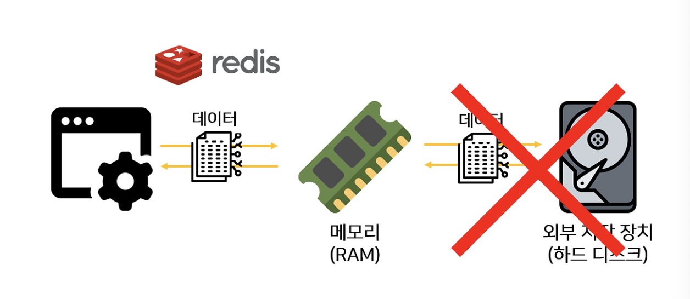

# Redis (In-memory Database)

- Remote에 위치하고 프로세스로 존재하는 In-Memory 기반의 Dictionary(key-value) 구조 데이터 관리 서버 시스템이다.
- key-value 구조 데이터란, mysql 같은 관계형 데이터가 아닌 비 관계형 구조로서 데이터를 그저 '키-값' 형태로 단순하게 저장하는 구조를 말한다.
- 관계형 데이터베이스와 같이 쿼리 연산을 지원하지 않지만, 대신 데이터의 `고속 읽기와 쓰기에 최적화` 되어 있다.
- 다양한 데이터 구조체를 지원함으로써 DB, Cache, Message Queue, Shared Memory 용도로 사용될 수 있다.
- 일반 db와 같이 디스크에 데이터를 쓰는 구조가 아니라 메모리에서 데이터를 처리하기 때문에 `작업 속도가 상당히 빠르다.`

### 특징
- NoSql DBMS로 분류되며, In-memory기반의 Key-Value 구조를 가진 데이터 관리 시스템
- 메모리 기반이라 모든 데이터들을 메모리에 저장하고 `조회에 매우 빠르다.`
- 메모리에 상주하면서 서비스의 상황에 따라 데이터베이스로 사용될 수 있으며, `캐시`로도 사용될 수 있다.
- Remote Data Storage로 여러 서버에서 같은 데이터를 공유하고 보고 싶을 때 사용할 수 있다.
- `다양한 자료구조를 지원한다.` (Strings, Set, Hashes...)
- 메모리 기반이지만 Redis는 영속적인 데이터 보존이 가능하다. (메모리는 원래 휘발성입니다.)
- Redis는 기본적으로 1개의 싱글 쓰레드로 수행되기 때문에, 안정적인 인프라를 구축하기 위해서는 `Replication(Master-Slave구조)` 가 필수이다.
- RAM은 휘발성인데 실행중인 Redis를 끄면 데이터가 전부 날라갈 수 있다고 생각이 들 수 있다. Redis는 in-memory이지만 `persistent on-disk 데이터베이스`이기도 하다.

### 사용하는 곳
- 인증 토큰 등을 저장
- Ranking 보드로 사용
- 유저 API Limit
- `Remote Dictionry로서 RDBMS의 캐시 솔루션`으로 사용 용도가 굉장히 높다.
- 캐싱이 필요할 때 많이 사용되는데, 즉시 `메시지를 주고 받아야 될 때`나, `장바구니의 삭제`와 같은 경우에 많이 사용하는 편이다.

---

#### Redis pub/sub
- Kafka -> 토픽에 publish되는 메시지들을 저장하는 구조이지만, Redis의 경우 publish된 메시지들을 저장하지 않는다. 이러한 이유로, Subscriber가 존재하지 않으면, 메시지가 사라지게 된다.
**Redis pub/sub는 메시지를 저장, 수신확인이 필요하지 않은 경우에 사용하면 좋은 방법이다. 그러나 수신확인을 하지않기 때문에 전송이 보장되지 않는다.**

#### 캐시 (Cache)
- Cache: 한번 조회된 데이터를 미리 특정 공간에 저장해놓고, 똑같은 요청이 발생하게 되면 서버에게 다시 요청하지 말고 저장해놓은 데이터를 제공해서 빠르게 서비스를 제공해주는 것을 의미한다.
- `미리 결과를 저장하고 나중에 요청이 오면 그 요청에 대해서 DB 또는 API를 참조하지 않고 Cache를 접근하여 요청을 처리하는 기법.`
- Redis Cache는 메모리 단 (In-Memory)에 위치한다. 따라서 용량은 적지만 접근 속도가 빠르다. but, 저장하려는 데이터 셋이 주어진 메모리 크기보다 크면 디스크를 쓰는 것이 올바른 선택이다.

#### 캐시의 구조 패턴
1. Look aside Cache 패턴
- 캐시를 한 번 접근하여 데이터가 있는지 판단한 후, 있다면 캐시의 데이터를 사용하고 없으면 실제 DB 또는 API를 호출한다.
- Cache Miss : 메모리에 찾고자 하는 데이터가 없어서 디스크에 조회 할때
- Cache Hit : 메모리에 찾고자 하는 데이터가 있을 때

2. Write Back 패턴
- 주로 쓰기 작업이 굉장히 많아서, INSERT 쿼리를 일일이 날리지 않고 `한꺼번에 배치 처리를 하기 위해 사용`한다.
- 특정 서비스에 쓰기 요청이 한꺼번에 몰리게 되면 DB 서버가 죽을 수도 있습니다. 이때, write back 기반의 캐시를 사용하면 캐시 메모리에 데이터를 저장해 놓고, 이후 DB 디스크에 업데이트 해 주면 안전하게 쓰기 작업이 가능합니다.
- 단점은, DB에서 디스크를 접근하는 횟수가 줄어들기 때문에 성능 향상을 기대할 수 있지만, DB에 데이터를 저장하기 전에 캐시 서버가 죽으면 데이터가 유실된다는 문제점이 있습니다.

#### 세션 스토어
- 보통 트래픽 부하를 방지하기 위해 로드밸런서에 서버를 여러 대 운영한다. 여러 대 운영하게 되면 클라이언트의 세션이 서로 서버마다 달라 서비스 이용에 지장을 줄 수 있다는 문제점을 가지게 된다.
- 이 [링크](https://inpa.tistory.com/entry/WEB-%F0%9F%8C%90-%EC%84%B8%EC%85%98Session-%EB%B6%88%EC%9D%BC%EC%B9%98-%EB%AC%B8%EC%A0%9C-%ED%95%B4%EA%B2%B0%EB%B2%95-%E2%B8%A2%EC%84%9C%EB%B2%84-%EB%8B%A4%EC%A4%91%ED%99%94-%ED%99%98%EA%B2%BD-%E2%B8%A5)를 참고하자.

**세션의 불일치 해결 방법**
1. Sticky Session 방식
- 말 그대로 고정된 세션을 의미한다.
- 클라이언트의 요청이 어느 한 서버에 도달해 세션 데이터가 생겼다면, 앞으로 해당 서버는 해당 클라이언트만의 요청/응답만 처리하도록 고정해주면 된다.
- AWS Elastic Load Balancer는 Sticky Session을 활용한 서비스를 제공한다.
- 특정 서버에 트래픽이 집중되는 문제와 세션 정보의 유실이라는 문제점이 있다.

2. Session Clustering 방식
- 서버들을 하나의 클러스터로 묶어 관리하고, 클러스터 내의 서버들이 세션을 공유할 수 있도록 하는 방식.
- 서버 세팅의 어려움과 추가 메모리 비용, 네트워크 트래픽 증가, 시차로 인한 세션 불일치가 발생될 수 있다.

3. Session Storage 방식
- 별도의 세션 저장소를 외부에서 생성하고 각 서버들이 가져와 사용하면?
- 별도의 세션 저장소를 두고 서버들이 이를 공유함으로써 세션 불일치를 해결하는 방식.
- 세션을 저장할 때 세션을 복제해 다른 서버들에 보낼 필요가 없어 WAS들끼리 불필요한 네트워크 통신 과정을 진행하지 않아도 되어 성능면에서도 유리하다.

---
### 참고자료
- [세션 불일치 문제 해결](https://inpa.tistory.com/entry/WEB-%F0%9F%8C%90-%EC%84%B8%EC%85%98Session-%EB%B6%88%EC%9D%BC%EC%B9%98-%EB%AC%B8%EC%A0%9C-%ED%95%B4%EA%B2%B0%EB%B2%95-%E2%B8%A2%EC%84%9C%EB%B2%84-%EB%8B%A4%EC%A4%91%ED%99%94-%ED%99%98%EA%B2%BD-%E2%B8%A5)
- [Redis 개념 소개 및 세션 관리](https://inpa.tistory.com/entry/REDIS-%F0%9F%93%9A-%EA%B0%9C%EB%85%90-%EC%86%8C%EA%B0%9C-%EC%82%AC%EC%9A%A9%EC%B2%98-%EC%BA%90%EC%8B%9C-%EC%84%B8%EC%85%98-%ED%95%9C%EB%88%88%EC%97%90-%EC%8F%99-%EC%A0%95%EB%A6%AC)
