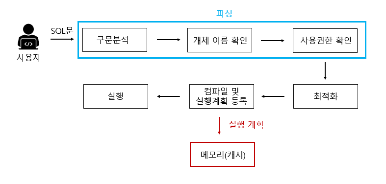

## 저장 프로시저(Stored PROCEDURE)
> 일련의 쿼리를 마치 하나의 함수처럼 실행하기 위한 쿼리의 집합

- SQL Server에서 제공되는 프로그래밍 기능
- 어떤 동작을 일괄 처리하기 위한 용도로 사용
- 자주 사용되는 일반 쿼리를 모듈화시켜서 필요할 때마다 호출
- 테이블처럼 각 DB 내부에 저장

 
 
 
 

## 일반 쿼리문 VS 저장 프로시저

### 일반 쿼리문 작동 방식

  

다음과 같은 순서로 일반 쿼리문이 동작한다. 

- 파싱 단계 (구문 분석 -> 개체 이름 확인 -> 사용 권한) 
- 최적화
- 컴파일 및 실행계획 등록 (캐시에 등록)
- 실행

`최적화`된 결과를 바탕으로 해당 실행계획 결과를 `메모리`에 등록한다.

 
 
 
 

### 저장 프로시저 작동 방식

### 1. 저장 프로시저 정의 단계
  

다음과 같은 순서로 저장 프로시저 정의 단계가 동작한다.
- `구문분석` : 구문의 오류 파악
- `지연된 이름 확인` : 저장 프로시저를 정하는 시점에서 해당 개체(ex. 테이블)가 존재하지 않아도 상관없다. 테이블의 존재 여부는 프로시저 실행 시 확인한다.(개체 이름 확인)
- `생성권한 확인` : 현재 사용자가 저장 프로시저를 생성할 권한이 있는지 확인
- `시스템 테이블 등록` : 저장 프로시저의 이름 및 코드가 시스템 테이블에 등록

 
 

### 2. 저장 프로시저 최초 실행
  

- 구문분석 단계가 빠지는 것을 제외하면 일반 쿼리문 수행단계와 동일하다.  
- 정의 단계 중 `지연된 이름확인` 과정에서 미뤘던 개체 존재 유무를 `개체 이름 확인` 과정을 통해 확인한다.

 
 

### 3. 저장 프로시저 이후 실행
  

- 최초 실행 이후의 프로시저 실행은 메모리에 있는 것을 가져와 재사용하게 되어 수행시간을 단축한다.

 
 

# 저장 프로시저의 장점

### SQL Server의 성능을 향상시킬 수 있다.
- 저장 프로시저의 두번째 실행부터는 `캐시에 있는 것을 사용`하므로 속도가 빨라진다.

### 유지보수 및 재활용이 용이하다.
- JAVA등의 응용 프로그램에서 직접 SQL문을 호출하지 않고 저장 프로시저의 이름을 호출하도록 설정하여 사용하는 경우, SQL의 변동이 있을 때 `SP 파일만 수정`하면 되기 때문에 유지보수 측면에서 용이하다.
- 한번 만들어둔 저장 프로시저는 언제든 실행이 가능하기 때문에 재활용 측면에서 좋다.

### 보안을 강화할 수 있다.
- 사용자 별로 테이블에 권한을 주는 것이 아닌, 저장 프로시저에만 접근 권한을 줌으로써 프로시저에서 선택한 정보만 사용자에게 보여줄 수 있다.

### 네트워크의 부하(전송량)를 줄일 수 있다.
- 클라이언트에서 서버로 여러 일반 쿼리를 전송할 경우 네트워킁에는 큰 부하가 발생하게 된다.
- 저장 프로시저를 이용한다면 저장 프로시저의 이름, 매개변수만 보내면 되기 때문에 부하를 크게 줄일 수 있다.

# 저장 프로시저의 단점

### DB 확장 어려움
- 저장 프로시저는 비지니스 로직을 DB 내부에 포함하고 있기 때문에 DB를 확장하거나 분산시키는 과정에서 저장 프로시저를 동일하게 배포하고 관리해야한다. 이는 유지 보수 및 관리의 복잡성을 증가시킨다.
- 저장 프로시저가 특정 DB에 종속적인 경우, 다른 DB로 마이그레이션하는 것이 어렵다.
### 데이터 분석의 어려움
- 개발된 프로시저가  여러 곳에서 사용 될 경우 수정했을 때 영향의 분석이 어렵다.
- 배포, 버전 관리 등에 대한 이력 관리가 힘들다.
- APP에서 저장 프로시저를 호출하여 사용하는 경우 문제가 생겨도 해당 이슈에 대한 추적이 힘들다.(별도의 에러 테이블 사용)
### 낮은 처리 성능
문자, 숫자열 연산에 저장 프로시저를 사용하면 C,JAVA보다 느린 성능을 보일 수 있다.

# Q 저장 프로시저와 일반 쿼리문의 차이점은 무엇인가요?
저장 프로시저는 일련의 쿼리를 하나의 함수처럼 묶어 실행할 수 있는 쿼리 집합이고 일반 쿼리문은 실행될 때 마다 개별적으로 처리되며, 저장 프로시저와 달리 구문 분석, 최적화, 컴파일 등 모든 단계를 매번 거쳐야 합니다. 따라서 저장 프로시저는 캐시된 실행 계획을 재사용할 수 있어 성능이 향상될 수 있다.