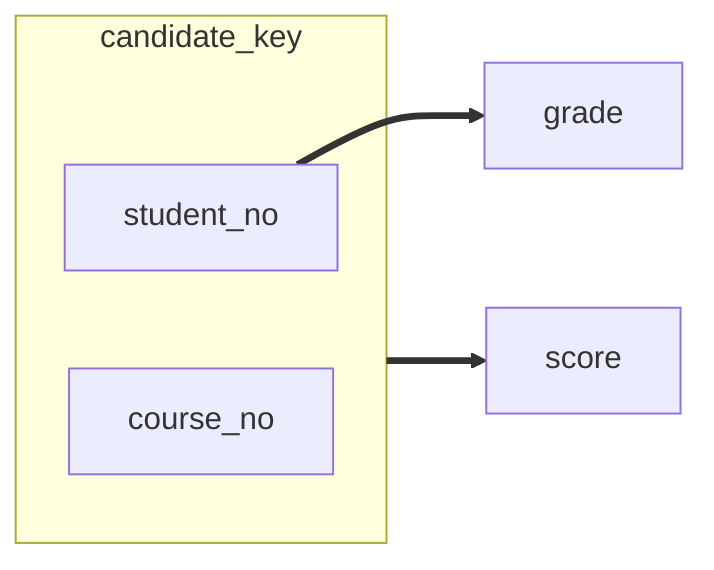
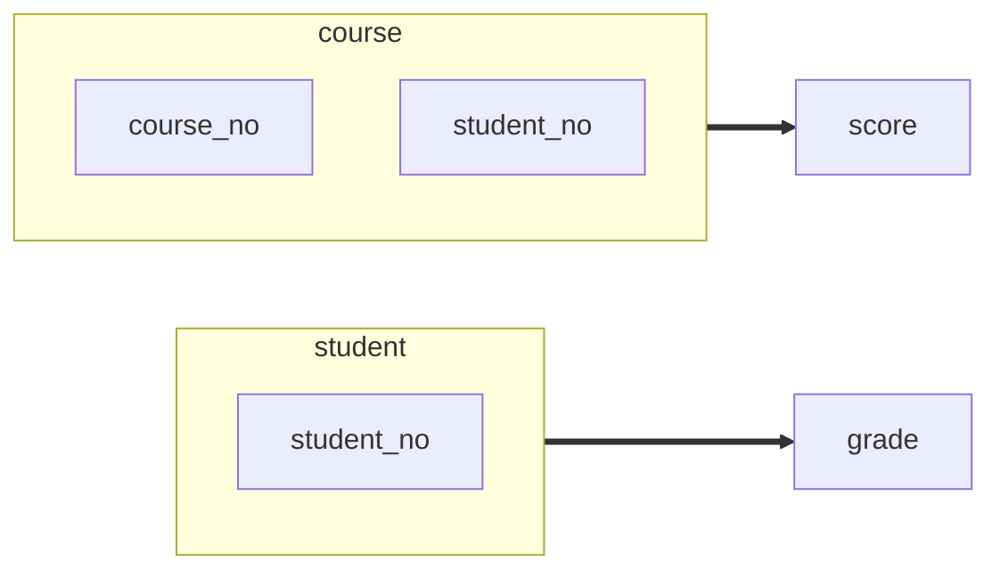
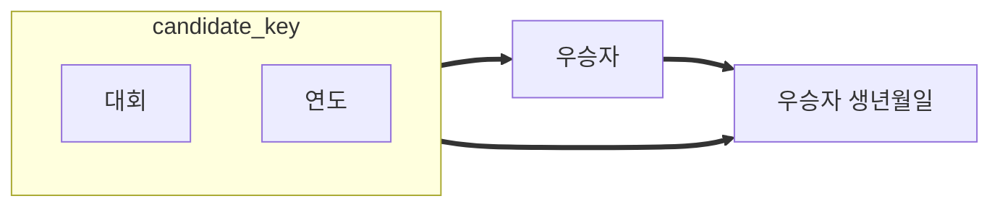
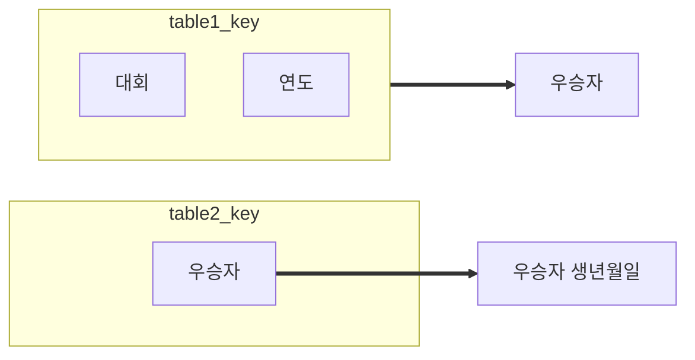

## Prerequisite

### [1. 이상 현상](https://joonamin.github.io/posts/%EC%9D%B4%EC%83%81-anomaly/)


### 2. 함수 종속

* Relation에서 두 개의 attribute 집합 간 제약의 일종

    * 여기서 `함수` 는 `식별 함수`를 의미함

* $$\textrm{릴레이션 } R$$ 에서, attribute의 부분 집합 $$X$$, $$Y$$ 를 고려할 때

    *  $$X$$값 각각에 대해 시간에 관계없이 항상 $$Y$$값이 하나만 연관되어 있는 상황에서
    * $$Y$$는 $$X$$에 **함수 종속(Functional Dependency)** 이다.
    * $$X \rightarrow Y$$ 로 표기한다.
    * 이 때 $$X$$를 <u>결정자</u>, $$Y$$를 <strong><u>종속자</u></strong> 라고 한다.

* 좀 더 formal하게 표현하자면 아래와 같다

    * $$X$$ 와 $$Y$$가 $$R$$의 attribute 집합의 부분 집합이면, $$X \rightarrow Y$$ 는 $$X$$가 $$Y$$ 멤버를 **함수적으로 결정**한다.

* ```mermaid
    mindmap
    	root((함수 종속))
    		완전 함수 종속
    		부분 함수 종속
    		이행적 함수 종속
    ```

#### **완전 함수 종속 (Full Functional Dependency)**

* $$X \rightarrow Y$$ 에서 $$Y$$ (종속자)가 **기본키에만 종속**
* 기본키가 <u>복합키</u>일 경우, <u>기본키를 구성하는 모든 속성이 포함</u>된 기본키의 부분집합에 종속된 경우

#### **부분 함수 종속 (Partial Functional Dependency)**

* Relation $$R$$ 에서 $$Y$$ 가 기본키가 아닌 다른 속성에 종속되거나
* 기본키가 <u>복합키</u>일 경우, 기본키를 구성하는 속성 중 <u>일부만 종속</u>되는 경우

#### **이행적 함수 종속 (Transitive Functional Dependency)**
* Relation $$R$$에서 attribute의 부분 집합 $$X, Y, Z$$ 에 대해서
* $$X \rightarrow Y, Y \rightarrow Z$$ 일 때, $$X \rightarrow Z$$ 를 만족할 경우
    * 즉, $$X$$를 알면 이행 관계에 따라서 $$Y, Z$$ 를 식별할 수 있는 경우


## 정규화(Normalization)

> 정규화는 관계형 데이터베이스의 설계에서 데이터 중복을 줄이고 데이터 무결성을 개선하기 위해 데이터를 정규형(normal form)에 맞도록 구조화하는 프로세스.
>
> 이상(Anomaly)이 있는 관계를 재구성하여 작고 잘 조직된 관계를 생성하는 것이 목적
>
> 정규화를 통해서 하나의 테이블에서의 데이터의 삽입, 삭제, 변경이 정의된 관계들로 인하여 데이터베이스의 나머지 부분들로 전파되게 하는 것
{: .prompt-info}


> 이상 현상(Anomaly)을 해결하기 위해서는 테이블의 특성을 잘 고려하여, 필요한 경우 더 높은 수준의 정규화를 진행하는 것이 좋습니다. 대부분의 이상 현상은 3NF까지 해결되므로 이 포스트에서는 제 3 정규화까지를 다룹니다.
{: .prompt-warning}


### 제 1 정규화 (비정규형 $$\rightarrow$$ 1NF)
* 1NF
    * **도메인 원자값**을 만족해야한다.
    * 최소한 테이블은 Relation이다.
    * 중복되는 항목이 없어야한다.
    * <u>속성 하나는 하나의 속성값만을 가져야한다.</u>
* 과정

    1. 각 테이블에서 중복을 제거한다

    2. 각각 관계된 데이터 모임을 위하여 분리된 테이블을 만든다

    3. 각각 관계된 데이터 모임을 기본키로 식별한다.


#### 예시1. 다중 값을 가지는 속성을 포함한 비정규형 테이블

| student_no | student_name | student_tel                  | student_addr | student_country |
| ---------- | ------------ | ---------------------------- | ------------ | --------------- |
| 1          | 강민준       | 010-1234-5678, 010-1111-2222 | gimhae       | korea           |
| 2          | 민준         | 010-5555-6666                | seoul        | korea           |
| 3          | joonamin     |                              | busan        | korea           |

다중 값을 가지는  `student_no = 1` 인 튜플에 대해서 `student_tel` attribute를 분리하여 아래와 같이 분리된 튜플로 만든다.

| student_no | student_name | student_tel   | student_addr | student_country |
| ---------- | ------------ | ------------- | ------------ | --------------- |
| 1          | 강민준       | 010-1234-5678 | gimhae       | korea           |
| 1          | 강민준       | 010-1111-2222 | gimhae       | korea           |
| ...        | ...          | ...           | ...          | ...             |


### 제 2 정규화 (1NF $$\rightarrow$$ 2NF)
* 2NF
    * **부분적 함수 종속을 제거**해야한다.
        * "[제 1 정규형](https://ko.wikipedia.org/wiki/제_1_정규형)(1NF)인 테이블이 제2 정규형을 충족시키는 필요충분조건은 다음과 같다: [후보 키](https://ko.wikipedia.org/wiki/후보_키) K와 K에 속하지 않는 속성 A가 있을 때, A를 결정하기 위해 K의 일부가 아닌 K 전체를 참조해야만 하는 경우 1NF 테이블은 2NF이다." [출처](https://ko.wikipedia.org/wiki/%EC%A0%9C2%EC%A0%95%EA%B7%9C%ED%98%95)
    * 1NF를 만족해야한다.
    * **기본키가 아닌 모든 속성이 기본키에 대해서 완전 함수 종속되면 2NF** 이다.


#### 예시 1. 부분적 함수 종속 관계를 가지는 속성이 포함된 테이블

| <u>student_no</u> | <u>course_no</u> | score | grade |
| ----------------- | ---------------- | ----- | ----- |
| 1                 | C1               | A     | 4     |
| 2                 | C2               | B     | 4     |
| 1                 | C4               | A     | 4     |
| 4                 | C3               | C+    | 1     |
| 4                 | C1               | C     | 1     |
| 2                 | C5               | A+    | 4     |

Relation에 포함된 attribute간 함수 종속 관계를 파악하기 쉽도록 `함수 종속 다이어그램`으로 표현하는 것이 좋다.

* 속성 자체의 특성과 의미를 기반으로 `함수 종속 다이어그램`을 작성한다.



튜플을 식별할 수 있는 최소성을 가진 후보키는 `{ student_no, course_no }` 이다.

`grade`를 살펴보면 후보키에 대해서, 부분적 함수 종속 관계를 가진다는 것을 알 수 있다.

이를 제거하기 위해서 함수 종속 관계에 있는 `student_no` $$\rightarrow$$ `grade` 를 다른 테이블로 분리하는 과정이 수행되어야한다.




위와 같이 `함수 종속 다이어그램`이 수정되어야하고, 이에 맞추어 테이블을 2개로 분리한다.


1. course 테이블

| <u>student_no</u> | <u>course_no</u> | score |
| ----------------- | ---------------- | ----- |
| 1                 | C1               | A     |
| 2                 | C2               | B     |
| 1                 | C4               | A     |
| 4                 | C3               | C+    |

2. student 테이블

| <u>student_no</u> | grade |
| ----------------- | ----- |
| 1                 | 4     |
| 2                 | 4     |
| 4                 | 1     |


#### 2NF 만으로는 이상 현상(Anomaly)를 완벽하게 해결할 수 없다.

**갱신 이상**이 발생하는 예제는 아래와 같다.

| <u>대회</u>          | <u>연도</u> | 우승자         | 우승자 생년월일   |
| -------------------- | ----------- | -------------- | ----------------- |
| Des Moines Masters   | 1998        | Chip Masterson | 14 March 1977     |
| Indiana Invitational | 1998        | Al Fredrickson | 21 July 1975      |
| Cleveland Open       | 1999        | Bob Albertson  | 28 September 1968 |
| Des Moines Masters   | 1999        | Al Fredrickson | 21 July 1975      |
| Indiana Invitational | 1999        | Chip Masterson | 14 March 1977     |




* `{대회, 연도}`, `우승자`, `우승자 생년월일`은 **이행적 함수 종속 관계**를 가진다.
    * `{대회, 연도}` 에 의해서 `우승자 생년월일` 이 결정되고 `우승자`에 의해서 `우승자 생년월일`이 결정되는 이행관계이다.
    * 이행관계가 남아 있을 경우, **갱신 이상이 여전히 발생할 수 있다**
        * 즉, `{대회, 연도}` 값에 대한 갱신 연산이 발생할 경우, `우승자`와 `우승자 생년월일` 또한 갱신이 이루어져야하는데, 갱신 시 주의하지 않으면 데이터의 불일치를 만들어낼 수 있다.
        * 이러한 현상은 `우승자` 와 `우승자 생년월일`이 밀접한 관계를 지녔음에도 불구하고, 이를 분리하지 않아서 발생하는 데이터 중복이 원인이 된다.


### 제 3 정규화 (2NF $$\rightarrow$$ 3NF)

* 3NF
    * Relation은 제 2 정규형을 만족해야하는 상태
    * **Relation의 키가 아닌 모든 attribute가 Relation의 모든 키에 이행적 종속이 되지 않는다.**


#### 예시 1. 이행적 종속 관계가 존재하는 2NF


앞에서 다뤘듯, 위 테이블에서는 `갱신 이상`이 발생한다.

이를 해결하기 위해서 `이행적 함수 종속 관계`를 제거해보자.




| <u>대회</u>          | <u>연도</u> | 우승자         |
| -------------------- | ----------- | -------------- |
| Des Moines Masters   | 1998        | Chip Masterson |
| Indiana Invitational | 1998        | Al Fredrickson |
| Cleveland Open       | 1999        | Bob Albertson  |
| Des Moines Masters   | 1999        | Al Fredrickson |
| Indiana Invitational | 1999        | Chip Masterson |

| 우승자         | 우승자 생년월일   |
| -------------- | ----------------- |
| Chip Masterson | 14 March 1977     |
| Al Fredrickson | 21 July 1975      |
| Bob Albertson  | 28 September 1968 |


**이행적 함수 종속 관계**를 제거하여 더 이상 갱신 이상이 발생하지 않는다는 것을 확인해볼 수 있습니다.

