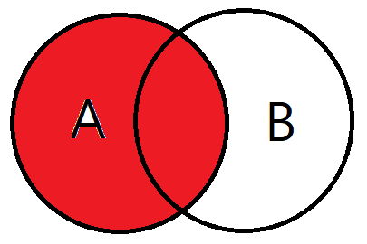

# 조인(Join)

### 조인
- 둘 이상의 테이블을 연결해서 데이터를 검색하는 방법

### 조인의 종류
- INNER JOIN
- LEFT OUTER JOIN
- RIGHT OUTER JOIN
- FULL OUTER JOIN
- CROSS JOIN
- SELF JOIN

### INNER JOIN
- 교집함으로, 기준 테이블(A)과 조인 테이블(B)의 공통된 부분을 보여준다.

  

### LEFT OUTER JOIN
- 기준 테이블 값 + 기준 테이블과 조인 테이블의 공통된 부분을 보여준다.
- INNER 조인에서 교집합에 속하지 않은 기준 테이블을 값을 추가로 가져온다는 뜻과 같다.

  

### RIGHT OUTER JOIN
- 조인 테이블 값 + 기준 테이블과 조인 테이블의 공통된 부분을 보여준다.
- INNER 조인에서 교집합에 속하지 않은 조인 테이블의 값을 추가로 가져온다는 뜻과 같다.

  

### FULL OUTER JOIN
- 기준 테이블과 조인 테이블의 모든 데이터가 검색된다. 

💡  오라클은 FULL OUTER JOIN이 있지만 MYSQL은 없기 때문에,   LEFT OUTER JOIN과 RIGHT OUTER JOIN을 같이 사용한다.  

  

### CROSS JOIN
- 모든 경우의 수를 전부 표현하여 검색
- 기준 테이블의 데이터가 4개, 조인 테이블의 데이터가 5개이면 20개의 데이터가 검색된다.

  

### SELF JOIN
- 자기 자신과 자기 자신을 조인하여 검색한다.
- ID, 이름, 페어 ID로 구성된 테이블이 있을 때, 자신의 페어 ID는 바로 확인할 수 있지만 페어의 이름은 바로 알기 어렵다. 이때 ID, 이름, 페어 ID, 페어 이름과 같은 방식으로 셀프 조인을 하여 해결할 수 있다.

  

# Q. 조인이 필요한 이유
관계형 데이터베이스는 정규화를 수행하면 의미 있는 데이터의 집합으로 테이블이 구성되어 저장 공간의 효율성과 확장성이 향상되게 된다. 하지만 서로 관계있는 데이터가 여러 테이블로 나뉘어 저장되므로 각 테이블에 저장된 데이터를 효과적으로 검색하기 위해 조인이 필요하게 된다.