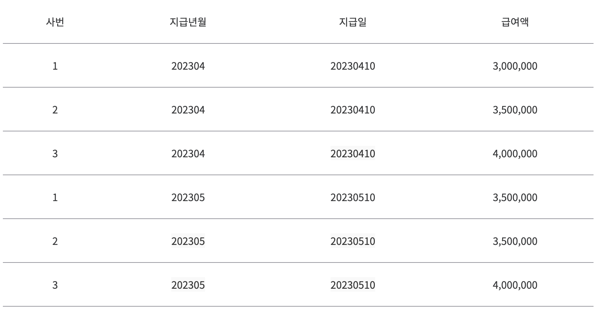

# Key

### Key의 종류
- 슈퍼 키(Super Key)
- 후보 키(Candidate Key)
- 기본 키(Primary Key)
- 대체 키(Alternate Key)
- 외래 키(Foreign Key)
- 복합 키(Composite Key)

### 유일성
- 각각의 튜플을 유일하게 식별할 수 있는 것을 의미

### 최소성
- 키를 구성하는 속성들 중 꼭 필요한 최소한의 속성들로만 구성하는 성질

  
- 위의 사진에서 사번만으로는 각 튜플을 구분할 수 없으므로, (사번,지급년월)으로 복합키를 구성할 수 있고. 이는 최소성을 만족한다.
- (사번,지급년월,급여액)으로 구성하면 급여액은 꼭 필요한 속성이 아니므로 최소성을 만족하지 않는다.

 
 

### 키의 관계 도식화
  

### 슈퍼 키(Super Key)
- 유일성을 만족하지만 최소성은 만족하지 않아도 된다.

### 후보 키(Candidate Key)
- 유일성과 최소성을 만족해야 한다.

### 기본 키(Primary Key)
- 후보키들 중에서 선택한 키.
- 유일성과 최소성을 만족해야 한다.
- 테이블에서 기본키는 1개만 지정할 수 있다.
- NULL을 가질 수 없고, 중복된 값을 가질 수 없다.

### 대체 키(Alternate Key), 보조 키
- 후보키들 중에서 기본키를 제외한 나머지 키.
- 유일성과 최소성을 만족해야 한다.

### 외래 키(Foreign Key)
- 어떤 테이블을 참조하는 키이다. 테이블들 간의 관계를 나타내기 위해 사용된다.
- 참조될 테이블이 먼저 만들어지고, 참조하는 테이블에 값이 입력되어야 한다.
- 참조되는 테이블의 기본키와 동일한 키 속성을 가진다.
- 자식 테이블을 먼저 삭제한 후 부모 테이블을 삭제해야 한다.

### 복합 키(Composite Key)
- 2개 이상의 속성을 사용한 키

# Q. 테이블에 기본 키를 지정하지 않으면 생기는 문제에는 무엇이 있나요?
### Clustered Index의 이점을 활용하지 못한다.
테이블은 Clustered Index를 다음과 같은 규칙으로 가진다.
1. PK를 Clustered Index로 사용한다.
2. PK가 없다면, NOT NULL 속성을 가진 UNIQUE KEY를 선택한다.
3. 이를 만족하는 KEY가 없다면 보이지 않는 컬럼을 내부적으로 추가해서 사용한다.

이렇게 생성된 Clustered Index는 테이블의 레코드를 물리적으로 재배열하여 검색 속도를 향상시킨다.
만약 보이지 않는 컬럼으로 Clustered Index가 생성된다면, 검색 성능 향상의 장점을 이용하지 못한다.

### 일관성 없는 데이터가 쌓일 수 있다.
각 행을 고유하게 식별하기 어렵기 때문에 같은 데이터가 여러번 쌓일 수 있다.

### 참조를 사용할 수 없다. (후보키도 존재하지 않는 경우)
FK를 통해서 참조를 할 수 없게 되며, JOIN을 통해서 데이터를 가져올 수 없게 된다.
