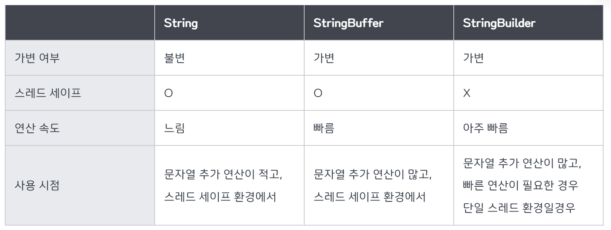

## String, StringBuffer, StringBuilder

자바에서는 대표적으로 문자열을 다루는 자료형 클래스로 `String, StringBuffer, StringBuilder` 라는 3가지 자료형을 지원한다.

---

### 1. String
- new 연산을 통해 생성된 인스턴스의 메모리 공간은 변하지 않음 (Immutable)
- Garbage Collector로 제거되어야 함.
- 문자열 연산시 새로 객체를 만드는 Overhead 발생
- 객체가 불변하므로, Multithread에서 동기화를 신경 쓸 필요가 없음. (조회 연산에 매우 큰 장점)

String 클래스 : 문자열 연산이 적고, 조회가 많은 멀티쓰레드 환경에서 좋음

### 2. StringBuffer/StringBuilder

- StringBuffer / StringBuilder 클래스는 문자열을 연산(추가하거나 변경) 할 때 주로 사용하는 자료형이다.
- 덧셈 연산자를 이용해 String 인스턴스의 문자열을 결합하면, 내용이 합쳐진 새로운 String 인스턴스를 생성하게 되어, 따라서 문자열을 많이 결합하면 결합할수록 공간의 낭비뿐만 아니라 속도 또한 매우 느려지게 된다는 단점이 있다.

- StringBuffer는 멀티 스레드 환경에서 안전하다는 장점이 있고, StringBuilder는 문자열 파싱 성능이 우수하다는 장점이 있다.

### 3. StringBuffer
- 내부적으로 버퍼라고하는 독립적인 공간을 가지게 되어, 문자열을 바로 추가할 수 있어 공간의 낭비도 없으며 문자열 연산 속도도 매우 빠르다.
- 버퍼 크기의 기본값은 16개의 문자를 저장할 수 있는 크기이며, 생성자를 통해 그 크기를 별도로 설정할 수도 있다.
- 문자열 연산중에 할당된 버퍼의 크기를 넘게 되면 자동으로 버퍼를 증강시킨다.

### 4. String vs. StringBuffer, StringBuilder

**문자열 자료형의 불변과 가변**
- String 객체의 값은 변경할 수 없다. -> `불변 자료형`
- String을 불변으로 설정한 이유 
    - 캐싱: String pool에 각 리터럴 문자열의 하나만 저장하며 다시 사용하거나 캐싱에 이용가능하며 이로 인해 힙 공간을 절약할 수 있다.
    - 보안: db 상요자 이름, 암호는 db 연결을 수신하기 위해 문자열로 전달되는데, 만일 번지수의 문자열 값이 변경이 가능하다면 해커가 참조 값을 변경하여 애플리케이션에 보안 문제를 일으킬 수 있다.
    - 동기화: 불변함으로써 동시에 실행되는 여러 스레드에서 안정적이게 공유가 가능하다.

- StringBuffer / StringBuilder는 가변
    - 객체의 공간이 부족해지는 경우 버퍼의 크기를 유연하게 늘려주어 `가변적`이라는 차이점이 있다.
    - 두 클래스는 내부 Buffer에 문자열을 저장해두고 그 안에서 추가, 수정, 삭제 작업을 할 수 있도록 설계되어 있다.
    

---
## 면접 예상 질문

### 1. String, StringBuilder, StringBuffer의 차이점은 무엇인가요?

String: 불변(immutable) 객체입니다. 한 번 생성된 문자열은 변경할 수 없으며, 문자열을 수정하면 새로운 String 객체가 생성됩니다. 이로 인해 메모리와 성능에 영향을 미칠 수 있습니다.

StringBuilder: 가변(mutable) 객체로, 문자열을 수정할 수 있습니다. 멀티스레드 환경에서는 안전하지 않지만, 성능이 뛰어나고, 문자열을 자주 수정하는 경우 사용하기 적합합니다.

StringBuffer: StringBuilder와 유사하지만, 멀티스레드 환경에서 안전하도록 설계된 클래스입니다. 동기화(synchronized)를 지원하여 여러 스레드가 동시에 접근하더라도 안전하게 사용 가능합니다. 하지만, 이로 인해 성능은 StringBuilder보다 떨어질 수 있습니다.

### 2. 어떤 상황에서 StringBuffer를 사용해야 할까요?

StringBuffer는 멀티스레드 환경에서 안전하게 문자열을 수정해야 할 때 사용해야 합니다. 여러 스레드가 동시에 문자열을 수정할 가능성이 있는 경우, StringBuffer를 사용하면 동기화된 메서드를 통해 데이터 무결성을 보장할 수 있습니다. 그러나 성능이 중요한 경우에는 StringBuilder를 사용하는 것이 더 효율적일 수 있습니다. 따라서, 스레드 안전성이 필요할 때 StringBuffer를 선택합니다.

---
#### 참고 자료: https://inpa.tistory.com/entry/JAVA-%E2%98%95-String-StringBuffer-StringBuilder-%EC%B0%A8%EC%9D%B4%EC%A0%90-%EC%84%B1%EB%8A%A5-%EB%B9%84%EA%B5%90
