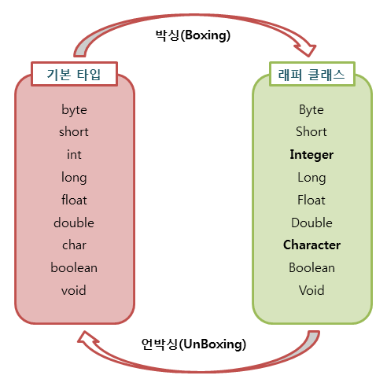

# 오토 박싱 & 오토 언박싱

### 래퍼 클래스
> 기본 타입을 객체로 다루기 위해서 사용하는 클래스를 래퍼(Wrapper) 클래스라고 한다.
- 래퍼 클래스는 불변(immutable) 객체이다.
- 값을 변경할 때는 객체의 값을 변경하는게 아닌, 새로운 값의 객체를 생성한다.

<br>

###  박싱(Boxing) 이란?
> 기본 타입을 래퍼 클래스로 변환하는 것
<br>

###  언박싱(UnBoxing) 이란?
> 래퍼 클래스를 기본 타입으로 변환하는 것

<br>




<br>

###  박싱 & 언박싱의 필요성
#### 💡 제네릭, 컬렉션은 객체 타입만 지원한다.
> 기본 타입을 제너릭, 컬렉션에 사용하기 위해서는 객체 타입으로 변환해야 한다.
``` java
List<Integer> list = new ArrayList<>();
list.add(new Integer(10)); // 컬렉션을 사용하기 위해 박싱
```


<hr>

### 오토 박싱과 오토 언박싱
> JDK 1.5부터 편의성을 위해 자바 컴파일러가 박싱과 언박싱을 자동으로 처리해준다. 

<br>

### 오토 박싱(Auto Boxing) 이란?
> 기본 타입을 자동으로 해당하는 래퍼 클래스로 변환하는 것을 말한다.
``` java
Integer A = new Integer(10); // 박싱
Integer num = 17; // 오토 박싱
```

<br>

### 오토 언박싱(Auto UnBoxing) 이란?
> 래퍼 클래스를 자동으로 해당하는 기본 타입으로 변환하는 것을 말한다.
``` java
Integer A = new Integer(10);
int num = A.intValue(); // 언박싱
int num = A; // 오토 언박싱
```

<br>

### 오토 박싱 & 오토 언박싱의 필요성
- 개발자의 편의성 증가
- 코드의 가독성 증가
``` java
List<Integer> intList = new ArrayList<>();

// 박싱
intList.add(Integer.valueOf(10)); 
int value = intList.get(0).intValue();

// 오토 박싱
intList.add(10); 
int value = intList.get(0); 
```

### 성능 문제
편의성 향상이라는 장점이 있지만, 오토 박싱과 언박싱 과정에서 추가적인 `객체 생성`과 `GC`가 발생할 수 있다.<br>
따라서 오토 박싱 & 언박싱을 방지하기 위해서는 기본형 타입을 직접 사용해야한다.
#### 오토 박싱 연산
``` java
public static void main(String[] args) {
    long t = System.currentTimeMillis();
    Long sum = 0L;
    for (long i = 0; i < 1000000; i++) {
        sum += i; // Long = Long + long  (오토 박싱 발생)
    }
    System.out.println("실행 시간: " + (System.currentTimeMillis() - t) + " ms");
}
// 실행 시간 : 19 ms
```
#### 동일타입(기본형) 연산
``` java
public static void main(String[] args) {
    long t = System.currentTimeMillis();
    long sum = 0L;
    for (long i = 0; i < 1000000; i++) {
        sum += i;
    }
    System.out.println("실행 시간: " + (System.currentTimeMillis() - t) + " ms") ;
}

// 실행 시간 : 4 ms
```

➕ 자바 8의 람다 표현식과 스트림 API를 사용하면 오토 박싱과 오토 언박싱을 줄일 수 있다.

## QnA

#### 1. 출력 결과는?
``` java
Integer A = new Integer(1);
Integer B = new Integer(1);
System.out.println(A == B);
```
<details>
<summary>정답</summary>

> false - 박싱된 경우 래퍼 클래스이기 때문에 equals()로 비교를 해야한다.
</details>

#### 2. 출력 결과는?
``` java
Integer A = 3;
A++;
System.out.println(A);
```
<details>
<summary>정답</summary>

> 4 <br>
처리 과정 <br>
A = new Integer(3); <br>
Integer = Integer + 1 <br>
Integer = int + 1 <br>
Integer = new Integer(int+1);
</details>


#### 3. 출력 결과는?
``` java
public static void add(Integer num) {
    num++;
}

Integer A = 3;
add(A);
System.out.println(A);
```
<details>
<summary>정답</summary>

> 3 <br>
객체의 값을 수정해서 4가 출력된다고 생각할 수 있지만, <br>
실제로는 num 객체 안의 3에 1을 더하는 것이 아니라, <br>
3과 1을 더한 후 새로운 Integer를 생성한다. <br>
</details>

