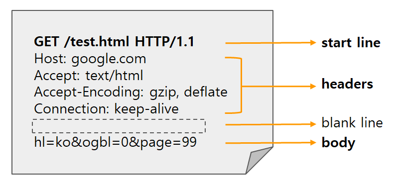
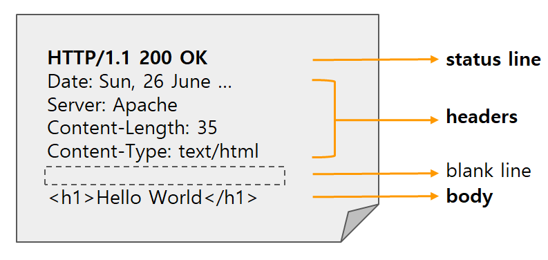

# HTTP & HTTPS
### HTTP(HyperText Transfer Protocol)
- 웹 브라우저와 웹 서버 간에 데이터를 주고받기 위해 사용하는 프로토콜.  
- 일반 텍스트로 교환하기 때문에 보안 문제가 존재한다.
- 80포트를 사용한다.

### HTTP Request Message 구조

#### start line
- Method, Path(request target), Protocol version을 가진다.
#### headers
- request에 대한 추가 정보를 담고 있다.
- Key:Value 형태로 구성
#### Body
- HTTP Request가 전송하는 데이터를 담고 있다.
- headers와 Body 사이에 공백 라인이 있어야 한다.

### HTTP Response Message 구조

#### status line
- HTTP의 response의 상태를 간략하게 나타내주는 부분
- Protocol version, status Code, Status Text를 가진다.
#### headers
- response에 대한 추가 정보를 담고 있다.
- response에만 사용되는 header 값들이 있다.
- user-agent(요청 디바이스, 브라우저 등의 정보) 대신 server헤더를 사용 
#### body
- HTTP Response가 전송하는 데이터를 담고 있다.
- headers와 Body 사이에 공백 라인이 있어야 한다.
 

### HTTP의 취약점
1. 도청이 가능하다
- HTTP는 데이터를 암호화하지 않기 때문에 데이터를 가로채면 내용이 노출되는 보안 문제가 존재한다.
- 통신자체를 암호화(HTTPS)하거나 데이터를 암호화 하는 방법등이 있다.
- 데이터를 암호화 하는 경우 수신측에서는 복호화 과정이 필요하다
2. 위장이 가능하다
- 통신 상대를 확인하지 않기 때문에 위장된 상대와 통신할 수 있다.
- HTTPS는 CA 인증서를 통해 인증된 상대와 통신이 가능하다.
3. 변조가 가능하다
- 완전성을 보장하지 않기 때문에 변조가 가능하다.
- HTTPS는 메세지 인증 코드(MAC), 전자 서명등을 통해 변조를 방지한다.

### HTTPS(HyperText Transfer Protocol Secure)
> HTTPS는 SSL 또는 TLS를 사용하여 `데이터를 암호화`하고, 인증서를 사용하여 통신하는 `서버의 신원을 확인`한다.

- 대칭키 암호화와 비대칭키 암호화를 모두 사용하여 빠른 연산 속도와 안정성을 모두 얻고 있다. 
- 443 포트를 사용한다.

### HTTPS를 위한 인증서 발급
> 서버는 HTTPS 프로토콜 사용을 위해 SSL인증서를 발급받아야 한다.  
인증된 기관(CA, Certificate Authority)에 공개키를 전송하여 인증서를 발급 받는다.

1. 서버의 공개키와 비밀키를 생성한다.
2. CA에 서버의 공개키와 서버의 정보를 전달한다.
3. CA는 서버로부터 받은 정보를 통해 SSL 인증서를 발급한다.
4. CA는 CA의 공개키와 비밀키를 생성하고, CA의 비밀키를 이용해 SSL 인증서를 암호화한다.
5. 암호화한 SSL인증서를 서버에 전달하여 SSL인증서 발급을 완료한다.

### HTTPS 동작 과정
HTTPS 연결 과정(Hand-Shaking)에서 서버와 클라이언트 간에 세션키를 교환한다.  
세션키는 데이터를 암호화하기 위해 사용되는 `대칭키`이다. (빠른 데이터 교환 가능) 

1. 클라이언트(브라우저)가 서버로 연결을 시도한다.
2. 서버는 암호화된 인증서(서버의 공개키,CA의 비밀키로 암호화함)를 클라이언트(브라우저)에게 준다.
3. 브라우저는 암호화된 인증서를 복호화하여 서버의 공개키를 얻는다.
- CA 기업의 공개키는 브라우저가 이미 알고 있다. (CA는 신뢰할 수 있는 기업으로 등록되어 있음)
4. 클라이언트는 A서버와 핸드셰이킹 과정에서 주고받은 난수를 조합하여 pre-master-secret-key(대칭키)를 생성한 뒤, A 서버의 공개키로 해당 대칭키를 암호화하여 서버로 보낸다.
5. A서버는 자신의 개인키로 복호화하여 클라이언트와 동일한 대칭키를 가진다.
6. 클라이언트와 서버는 pre-master-secret-key를 master-secret-key로 만든다.
7. master-secret-key를 통해 세션키를 생성하고, 이를 이용해서 대칭키 방식으로 통신한다.
8. 각 통신이 종료될 때 마다 세션키를 파기한다.

#### HTTPS도 항상 안전하지는 않다.  
신뢰받는 CA기업이 아닌 자체 인증서를 발급한 경우, HTTPS지만 브라우저에서 `주의 요함`, `안전하지 않은 사이트`와 같은 알림으로 주의를 준다.

### Q. HTTPS란? HTTP와의 차이
HTTP를 사용하되 SSL(Secure Socket Layer) 혹은 TLS(Transfer Layer Security)와 같은 암호화 프로토콜을 계층에 추가한 것  
HTTP는 보안에 취약하지만, HTTPS는 SSL혹은 TLS를 사용해서 데이터를 `암호화`하고, 인증서를 사용해 `서버의 신원`을 확인할 수 있다.  
HTTP는 80포트를 사용하고 HTTPS는 443포트를 사용한다.

   

[참고]https://velog.io/@alscjf6315/HTTPS-%EC%9D%98-%EB%8F%99%EC%9E%91%EC%9B%90%EB%A6%AC