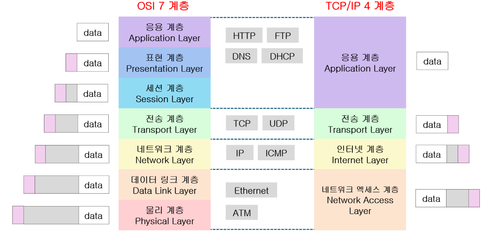

---
# OSI 7계층 

### 1. 물리 계층
- 가장 아래에 위치해 있으며, 물리적인 매체(LAN, 케이블 등) 을 통해 비트 스트림을 전송한다.  
케이블을 통하여 비트 데이터를 전송하는 것이다.

### 2. 데이터 링크 계층
- 물리 계층에서는 단순히 데이터를 전달만 하기에 데이터 상에 문제가 발생하여도 알 수가 없다. 
데이터 링크 계층에서는 데이터 시작과 끝 부분에 제어 정보를 추가하여 에러를 확인하고 제어한다. 또한, mac 주소를 할당하여 네트워크 장비들을 식별한다.

### 3. 네트워크 계층
- 데이터를 전송하는 스위칭 기능과 데이터를 전송을 위한 최적의 경로를 결정하는 `라우팅`기능을 제공한다.   라우터가 최적의 경로를 탐색하여 패킷을 전송하는 것이다.

### 4. 전송 계층
- 목적지까지 에러 제어, 흐름 제어등을 수행하며 신뢰성 있는 데이터 전송을 담당한다.  
하위 계층인 네트워크 계층과 다른 점은 네트워크 계층은 패킷 순서는 보장되지 않고 전송된다.  
하지만 전송 계층은 수신지와 목적지를 감독하면서 전체 데이터가 오류 없이 순서대로 도착하는 것을 보장한다. 전송 계층의 대표적인 프로토콜로 `TCP(Transport Protocol)과 UDP(User Datagram Protocol)`이 있다.

### 5. 세션 계층
- 세션 계층에서는 사용자의 논리적인 연결 서비스를 제공한다. 예를 들어 파일을 전송하던 중에 전송이 중단되어 이어서 전송 해야 하는 경우, 데이터를 동기화하고 통신 세션을 설정하고 유지하는 역할을 한다.

### 6. 표현 계층
- 데이터를 변환, 인코딩, 압축, 암호화, 복호화를 수행하여 상위 계층인 응용 계층이 이해할 수 있는 데이터로 가공한다. 표현 계층의 대표적인 예시로 JPEG, AVI등이 있다.

### 7. 응용 계층
- 사용자와 통신할 수 있는 응용 서비스를 제공한다. 대표적인 예시로 웹 브라우저, FTP등이 있다.

# TCP/IP 4계층

TCP/IP 모델은 네트워크 통신을 위한 프로토콜 모음으로, 네 계층으로 구성.

### 1. 네트워크 인터페이스 계층
- 기능: `물리적 연결과 데이터 링크 계층을 통합한 계층`으로, 물리적인 네트워크 장치와의 연결 및 데이터 프레임의 전송을 담당합니다.
- 역할: 이 계층은 `OSI 모델의 물리 계층과 데이터 링크 계층의 기능을 포함`하며, 데이터를 실제 네트워크 매체(예: Ethernet, Wi-Fi)를 통해 전송합니다. MAC 주소를 사용하여 네트워크 장치를 식별하고, 에러 검출 및 제어 기능을 수행합니다.

### 2. 인터넷 계층
- 기능: 물리적 연결과 데이터 링크 계층을 통합한 계층으로, 물리적인 네트워크 장치와의 연결 및 데이터 프레임의 전송을 담당합니다.
- 역할: 이 계층은 `OSI 모델의 물리 계층과 데이터 링크 계층의 기능`을 포함하며, 데이터를 실제 네트워크 매체(예: Ethernet, Wi-Fi)를 통해 전송합니다. MAC 주소를 사용하여 네트워크 장치를 식별하고, 에러 검출 및 제어 기능을 수행합니다.

### 3. 전송 계층
- 기능: 종단 간 통신을 책임지며, `데이터의 정확하고 신뢰성 있는 전송을 보장`합니다.
- 역할: 이 계층은 `TCP(Transmission Control Protocol)와 UDP(User Datagram Protocol)와 같은 프로토콜을 사용`하여 데이터 전송을 관리합니다.  TCP는 연결 지향적이며, 데이터의 신뢰성, 순서 보장, 오류 복구 등을 담당합니다. UDP는 비연결 지향적이며, 빠른 전송 속도를 요구하는 응용 프로그램에서 주로 사용됩니다. 전송 계층은 포트 번호를 통해 응용 프로그램 간의 통신을 지원합니다.

### 4. 응용 계층
- 기능: 네트워크 상에서 사용자와의 인터페이스를 제공하며, 다양한 응용 프로그램에 네트워크 서비스를 제공합니다.
- 역할: 이 계층은 사용자에게 다양한 네트워크 서비스를 제공합니다. 예를 들어, HTTP(웹 브라우징), FTP(파일 전송), SMTP(이메일 전송) 등의 프로토콜이 포함됩니다. 응용 계층은 데이터의 형식과 내용을 처리하며, `사용자와 직접적으로 상호 작용`합니다.

## 면접 예상 질문 정리
#### 1: OSI 모델의 각 계층을 설명하세요.

답변:

물리 계층: 비트 전송, 물리적 연결
데이터 링크 계층: 프레임 전송, 오류 검출 및 수정
네트워크 계층: 패킷 전송, 경로 설정
전송 계층: 종단 간 통신, 신뢰성, 오류 복구
세션 계층: 세션 관리, 데이터 교환 제어
표현 계층: 데이터 형식 변환, 암호화, 압축
응용 계층: 네트워크 접근 인터페이스 제공

#### 질문 2: TCP와 UDP의 차이점을 설명하세요.
답변:

TCP: 연결 지향적, 신뢰성 보장, 흐름 제어, 오류 복구 (예: HTTP, FTP)
UDP: 비연결 지향적, 신뢰성 미보장, 낮은 오버헤드 (예: DNS, VoIP)

#### 질문 3: 라우터와 스위치의 차이점을 설명하세요.
답변:

라우터: 네트워크 간의 데이터 패킷을 전달, IP 주소 사용
스위치: 같은 네트워크 내에서 데이터 프레임을 전달, MAC 주소 사용

#### 질문 4: DNS가 어떻게 동작하는지 설명하세요.
답변:
DNS는 도메인 이름을 IP 주소로 변환합니다. 클라이언트가 도메인 이름을 요청하면, DNS 서버는 해당 도메인의 IP 주소를 반환하여 웹사이트에 접근할 수 있게 합니다.

#### 참고자료
[network 전체 흐름 - 예전 스터디 정리한 자료](https://right-airbus-41b.notion.site/GDSC-b9245289e5444d8293f4c73638daa5dd?pvs=4)