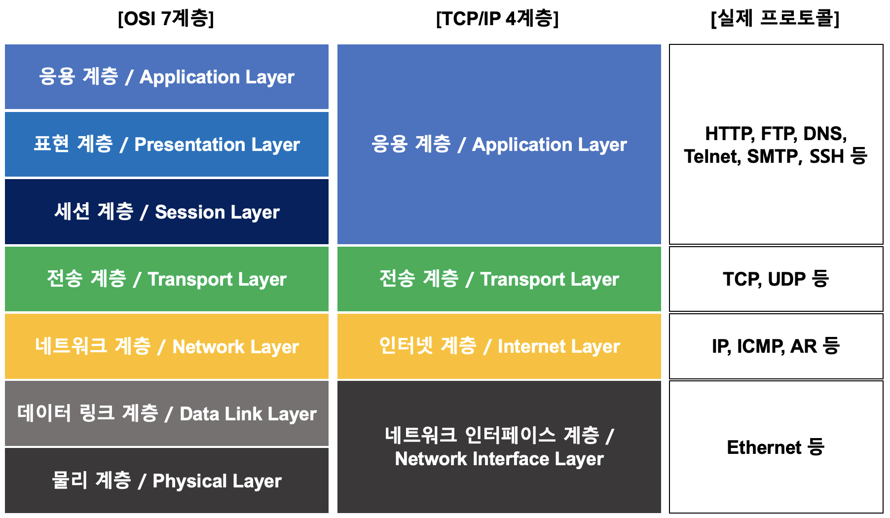

---
# OSI 7계층 

# TCP/IP 4계층

## 면접 예상 질문 정리
#### 1: OSI 모델의 각 계층을 설명하세요.

답변:

물리 계층: 비트 전송, 물리적 연결
데이터 링크 계층: 프레임 전송, 오류 검출 및 수정
네트워크 계층: 패킷 전송, 경로 설정
전송 계층: 종단 간 통신, 신뢰성, 오류 복구
세션 계층: 세션 관리, 데이터 교환 제어
표현 계층: 데이터 형식 변환, 암호화, 압축
응용 계층: 네트워크 접근 인터페이스 제공

#### 질문 2: TCP와 UDP의 차이점을 설명하세요.
답변:

TCP: 연결 지향적, 신뢰성 보장, 흐름 제어, 오류 복구 (예: HTTP, FTP)
UDP: 비연결 지향적, 신뢰성 미보장, 낮은 오버헤드 (예: DNS, VoIP)

#### 질문 3: 라우터와 스위치의 차이점을 설명하세요.
답변:

라우터: 네트워크 간의 데이터 패킷을 전달, IP 주소 사용
스위치: 같은 네트워크 내에서 데이터 프레임을 전달, MAC 주소 사용

#### 질문 4: DNS가 어떻게 동작하는지 설명하세요.
답변:
DNS는 도메인 이름을 IP 주소로 변환합니다. 클라이언트가 도메인 이름을 요청하면, DNS 서버는 해당 도메인의 IP 주소를 반환하여 웹사이트에 접근할 수 있게 합니다.

#### 참고자료
[network 전체 흐름 - 예전 스터디 정리한 자료](https://right-airbus-41b.notion.site/GDSC-b9245289e5444d8293f4c73638daa5dd?pvs=4)