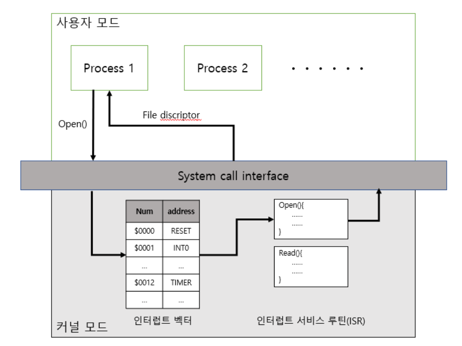

# 인터럽트
### 인터럽트란
프로그램을 실행하는 도중에 예기치 않은 상황이 발생할 경우 현재 실행 중인 작업을 중단하고, 
발생된 상황에 대한 우선 처리가 필요함을 CPU에게 알리는 것
 

### 인터럽트의 종류
- 외부 인터럽트(하드웨어 인터럽트)
- 내부 인터럽트(소프트웨어 인터럽트)
- 시스템 콜

 

### 외부 인터럽트
> 입출력 장치, 타이밍 장치, 전원 등의 `외부적인` 요인에 의해서 발생하는 인터럽트

#### 외부 인터럽트에는 `타이머 인터럽트`, `I/O 인터럽트`, `전원 이상 인터럽트`가 있다.
 

### 타이머 인터럽트
- 1초 마다 동작 등 일정 시간이 지나면 인터럽트가 발생
### I/O 인터럽트
- 마우스를 움직이거나, 입출력 장치의 수행 완료 시
### 전원 이상 인터럽트
- 전원에 이상이 있는 경우

### 내부 인터럽트
> Trap이라고도 부르며, 잘못된 명령이나 데이터를 사용할 때 발생하는 인터럽트

### 다음과 같은 경우 발생
- 0으로 나누는 경우
- 오버플로우, 언더플로우가 발생한 경우
- 명령어를 잘못 사용한 경우

### 시스템 콜
> 프로세스가 시스템의 자원이나 서비스를 필요로 할 경우 운영체제에게 요청하는 것 

응용 프로그램은 유저 모드의 기능 만으로는 많은 기능을 구현하기 힘들기 때문에 커널의 도움을 받아야 하고, 커널 모드를 통한 작업은 반드시 시스템 콜을 통해 수행해야한다.

### 이중 동작 모드
사용자와 OS는 시스템 자원을 공유하기 때문에 사용자에게 제한을 두지 않으면 주요 자원을 망가뜨릴 위험이 있다.  
이중 동작 모드는 사용자가 접근할 수 없는 `커널 모드`와 접근할 수 있는 `사용자 모드`로 나뉜다.

### 커널 모드
- 모든 시스템 자원에 접근할 수 있다.
- 프로세스는 단일 가상 주소 공간을 얻는다.

### 유저 모드
- 제한적으로 시스템 자원에 접근할 수 있다.
- 자체 가상 주소 공간을 얻는다.
- 시스템 콜을 통해 커널 모드로 전환할 수 있다.

### 인터럽트 발생 시 처리 과정

 

> 원래 실행 중이던 곳으로 돌아오기 위해 `복귀 주소 저장` 과정이 필요하다.

 

### 인터럽트 벡터

 

 

운영체제 커널에서는 인터럽트 발생 시 해야할  일`(ISR, 인터럽트 서비스 루틴)`을 미리 작성 해두었다.  
`ISR`을 찾아가기 위해 `인터럽트 벡터 테이블(IDT, Interrupt Descriptor Table)`에서 인터럽트에 해당하는 주소(ISR의 위치)로 이동한다.
 
`인터럽트 벡터 테이블`은 인터럽트 종류마다 번호를 정해서, 번호에 따라 `ISR`의 위치를 가리키고있는 `인터럽트 벡터`들을 저장한다.

 

### Q. 인터럽트와 폴링 방식의 차이?
- `인터럽트 방식`은 `하드웨어적`으로 변화를 체크하여 변화 시에만 처리를 하는 방식이고,  
- 폴링 방식은 대상을 특정 주기마다 확인하여 상황이 발생하면 해당 처리 루틴을 실행해서 처리한다.

- 폴링 방식은 `구현이 쉽다`는 장점이 있지만 `반응 속도가 느리고`, 발생 타이밍을 `정확히 판단하는 것은 어렵다`.  
- 인터럽트 방식은 `구현이 복잡`하지만 `반응 속도가 빠르고`, `정확한 타이밍`을 알 수 있다.

