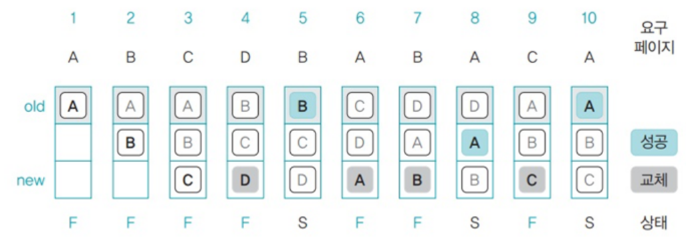
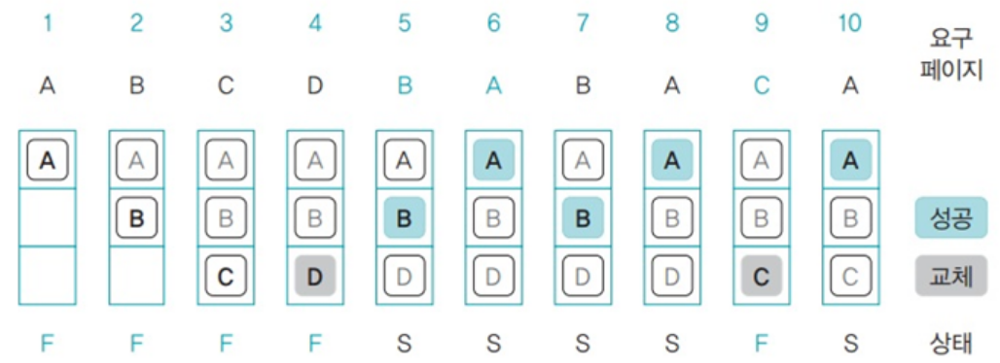
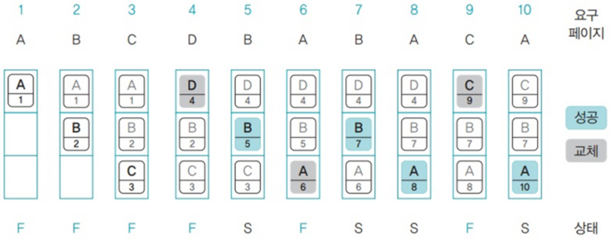
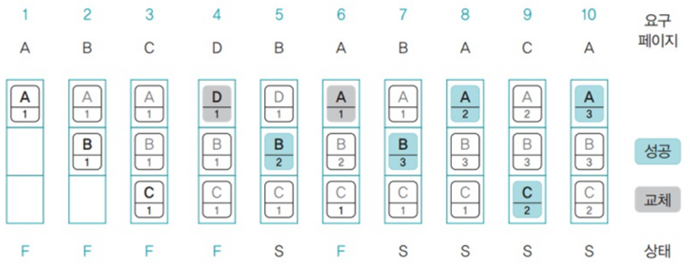
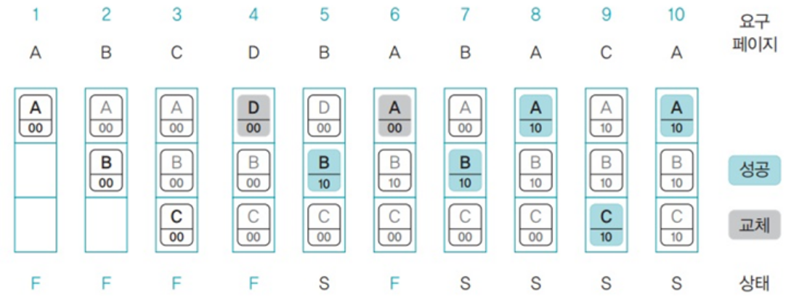

# 페이지 교체 알고리즘
### 페이지 교체 알고리즘
가상 메모리 기법에서는 주기억장치보다 더 큰 용량의 프로그램을 실행하기 위해 프로그램의 일부만 주기억장치에 적재하여 사용한다.  
이때 필요한 페이지가 주기억장치에 적재되지 않았을 때 어떤 페이지 프레임을 선태갛여 교체할 것인지 결정하는 방법을 `페이지 교체 알고리즘`이라고 한다.

### 페이지 교체 알고리즘 종류
- FIFO(First In First Out)
- OPT(Optimal)
- LRU(Least Recently Used)
- LFU(Least Frequently Used)
- NUR(Not Used Recently)

### FIFO(First In First Out)
가장 먼저 들어온 페이지를 교체한다.  
큐를 사용해 구현한다.
무조건 오래된 페이지가 교체 대상이 되어 성능이 떨어질 수 있다.

  

### OPT(Optimal), 최적 페이지 교체 알고리즘
앞으로 가장 오랫동안 사용되지 않을 페이지를 교체한다.  
가장 이상적인 페이지 교체 알고리즘이지만, 프로세스가 앞으로 사용할 페이지를 미리 알아야해서 실제로는 불가능하다.  

  
앞으로 사용하지 않을 D를 교체한다.

### LRU(Least Recently Used)
가장 오랫동안 사용되지 않은 페이지를 교체한다.  
가장 오랫동안 사용하지 않았던 데이터라면 앞으로도 사용할 확률이 적을 것이라는 가정  
시간을 기록해야 하므로 많은 오버헤드가 발생한다.

  

### LFU(Least Frequently Used)
페이지의 참조 횟수를 기준으로 교체한다.  
FIFO 페이지 교체 알고리즘보다 성능은 우수하지만, 페이지 접근 횟수를 표시하는데 메모리가 추가로 필요하다.
  

### NUR(Not Used Recently)
각 페이지마다 참조 비트와 변형 비트를 이용해 적절한 페이지 교체 대상을 선택한다.  
페이지가 프레임에 적재된 후 비트 상태 00 (참조비트,변형비트 순) 
페이지 참조 후 비트 상태 (10) 
페이지 수정 후 비트 상태 (01) 
페이지 참조 및 수정 후 상태 (11) 

각 페이지의 비트 상태를 보고 교체될 페이지를 선택한다. 
교체될 페이지의 우선 순위
1. 00
2. 10
3. 01
4. 11
모든 페이지가 11이 되면 모든 페이지 비트를 00으로 초기화한다.

LRU, LFU 페이지 교체 알고리즘과 성능이 비슷하지만, 불필요한 공간 낭비를 줄일 수 있다.(적은 오버헤드)
  

# Q. 스레싱이란 무엇인가요?
스레싱은 CPU 작업 시간보다 메모리와 스왑 영역 간 페이지 교체에 시간을 더 많이 소비하는 것을 말한다.
다중 프로그래밍 정도가 높아지면 프로세스에게 할당되는 메모리의 양이 감소하여 `페이지 부재`가 빈번하게 발생하게 되어 CPU 이용률이 떨어지는데, 운영체제는 CPU 이용률이 낮으면 다중 프로그래밍 정도를 더 높이게 되어 악순환이 생기게 된다. 
