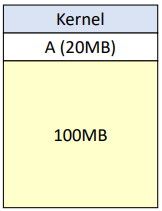

1. 메모리 관리 기법
    연속 메모리 관리
        고정 분할 기법
        동적 분할 기법
    불연속 메모리 관리
        고정 크기(페이징)
        가변 크기(세그멘테이션)
    단순 페이징
    단순 세그멘테이션
    가상 메모리 페이징
    가상 메모리 세그멘테이션

# 페이징 & 세그멘테이션
### 메모리 관리 기법
1. 연속 메모리 관리
    - 고정 분할 기법
    - 동적 분할 기법
2. 불연속 메모리 관리
    - 고정 크기(페이징)
    - 가변 크기(세그멘테이션)

### 1. 연속 메모리 관리 - 고정 분할 기법
- 메모리 공간을 고정된 크기로 분할한 뒤, 각 분할마다 하나의 프로세스를 적재하는 방식  

15 MB의 프로세스를 파티션C에 할당하면 5MB의 공간이 남는다. (내부 단편화 발생)  
60 MB의 프로세스를 할당할 수 있는 파티션이 없음. (외부 단편화 발생)

고정 분할 기법은 간단한 방식으로 오버헤드가 낮다는 장점이 있지만,  
내부/외부 단편화가 발생하여 자원이 낭비될 수 있다.
 

### 2. 연속 메모리 관리 - 동적 분할 기법
동적 분할 기법은 메모리 크기를 동적으로 분할한다.  

초기 상태  

  

프로세스 A 적재  

  

프로세스 B,C,D 적재  

  

프로세스 B 해제  

  

위 상황에서 5MB의 프로세스가 들어온다면 10MB의 공간에 할당할지 45MB의 공간에 할당할 지 정해야 한다. 
이때 사용하는 것이 <b>배치전략</b>이다.  

### 배치 전략
- 최초 적합 (First-Fit)  
적재할 수 있는 가장 처음 공간에 배치하는 방법
- 최적 적합 (Best-Fit)  
적재할 수 있는 공간 중 내부 단편화가 가장 작은 곳에 배치하는 방법
- 최악 적합 (Worst-Fit)  
적재할 수 있는 공간 중 내부 단편화가 가장 큰 곳에 배치하는 방법

### 공간 통합
공간 통합은 인접한 빈 영역을 하나의 파티션으로 통합하는 과정이다. 

  

### 메모리 압축 방식
메모리 압축 방식은 모든 빈 공간을 하나로 통합하는 과정이다.  
실행 중인 프로세스의 주소를 전부 바꿔주어야 하므로 높은 오버헤드가 발생한다.  

  

### 2.불연속 메모리 관리 - 고정 크기 (페이징)
- 페이징은 `외부 단편화`의 해결 방법으로, 주소를 불연속적으로 할당하는 메모리 관리 구조이다.  
- `페이지(page)` : 가상 메모리를 일정한 크기로 나눈 블록  
- `프레임(frame)` : 물리 메모리를 일정한 크기로 나눈 블록  
- 페이지 크기와 프레임 크기는 동일하다.  

  

프로세스가 페이지로 나누어진 후, 각 페이지가 몇 번 프레임에 할당되었는지 매핑하기 위해 `페이지 테이블`을 사용한다. (페이지 테이블은 프로세스마다 개별적으로 가진다) 
또한 페이지와 프레임의 크기가 동일하기 때문에 `외부 단편화`를 해결할 수 있다. (내부 단편화는 발생)

### 3.불연속 메모리 관리 - 가변 크기 (세그멘테이션)
- 가상 메모리를 서로 다른 크기의 세그먼트 단위로 분할  
- 세그먼트는 논리적 내용을 기준으로 프로그램을 분할하므로 크기가 다르다.  

  
- 분할하는 방식만 페이징과 다르고 매핑 테이블의 동작 방식은 동일하다.  
- 세그먼트 방식에서는 `세그먼트 테이블`을 사용하여 매핑을 한다.  
- `내부 단편화`가 발생하지 않음, `외부 단편화`가 발생 함

### 가상 메모리

주기억 장치의 부족한 저장공간을 보조기억 장치를 이용해서 가상으로 늘려주는 기술이다.

- 프로세스 전체가 메모리에 올라오지 않더라도 실행이 가능하도록 하는 기법이다.
- 실행에 필요한 부분만 메모리에 올려 실행한다.
- 페이징 또는 세그멘테이션을 사용한다.

장점
- 실제 메모리보다 큰 프로그램을 실행할 수 있다.
- 한정된 메모리 내에서 더 많은 프로그램을 동시에 실행할 수 있다. 

단점
- 가상 메모리로 실행하는 것은 물리 메모리로 실행하는 것보다 느리다.

 
 
 

# Q. 내부 단편화와 외부 단편화가 무엇인지 설명
- 내부 단편화  
메모리를 할당할 때 프로세스가 필요한 양보다 더 큰 메모리가 할당되어 프로세스에서 사용하는 메모리 공간이 낭비되는 현상
- 외부 단편화  
메모리가 할당/해제 작업의 반복으로 총 메모리 공간은 충분하지만 실제로 할당할 수 없는 현상
