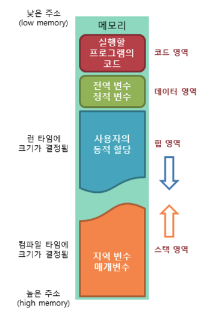
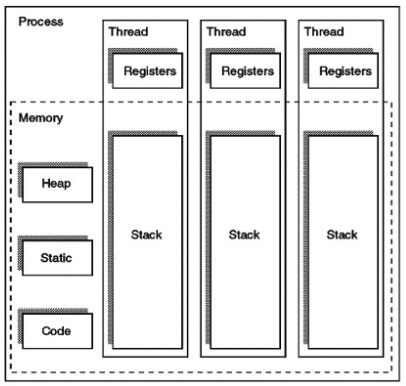

# 프로세스 주소 공간
### 프로세스 주소 공간의 구조

#### 프로세스의 주소 공간은 `코드`, `데이터`, `힙`, `스택` 영역으로 구성된다.
#### 최대한 데이터를 공유하여 메모리 사용량을 줄이기 위해 이런 구조로 구성되었다.

### 코드(Text) 영역
- 프로그램이 실행될 수 있도록 CPU가 해석 가능한 기계어 코드가 저장되어 있는 공간
- 프로그램이 수정되면 안되므로 ReadOnly 상태로 저장되어 있다.
- 컴파일 시 결정된다.
- 같은 프로그램으로 실행된 여러 프로세스는 동일한 코드를 가진다. (메모리 절약)

### 데이터 영역
- 전역 변수, 정적(static)변수, 상수 등이 위치한다.
- 프로그램 시작 시 할당되며, 프로그램 종료 시 소멸된다.
- 한 프로세스 내 여러 스레드가 공통으로 데이터 영역을 공유한다. (메모리 절약)
- 실행 중에 변수가 수정될 수 있기에 Read-Write 상태로 저장되어 있다.

### 힙 영역
- 동적 할당을 위한 메모리 영역이다.
- 런타임에 크기가 결정된다.
- 주로 참조형 데이터(객체)가 할당된다.
- GC에 의해 정리된다.
- 메모리의 낮은 주소에서 높은 주소의 방향으로 할당된다.

### 스택 영역
- 함수가 끝난 뒤 복귀할 주소, 지역 변수, 매개변수, 반환값이 저장되는 영역이다.
- 함수의 호출과 함께 할당되며, 함수의 호출이 완료되면 소멸한다.
- 메모리의 높은 주소에서 낮은 주소의 방향으로 할당된다.
- 재귀 함수가 너무 깊게 호출되는 등의 이유로 stack 영역을 초과하면 stack overflow 에러가 발생한다.
- 컴파일 시 크기가 결정된다.

### 스레드 주소 공간

- 멀티 스레드 상황에서 같은 프로세스 내의 스레드는 코드, 데이터, 힙 영역을 공유한다.
- 스택 영역은 공유하지 않고 스레드 별로 할당 받는다.
- 자원을 공유하기에 동기화 문제가 발생할 수 있다.

### TLS(Thread Local Storage)
스레드 별로 `고유한 전역변수`를 저장하는 영역을 TLS라고 부른다.

### Q. 스택을 스레드마다 할당하는 이유?
스택 영역은 함수의 복귀 주소, 지역 변수 등을 저장하기 위한 공간이다.  
스택 메모리 공간이 독립적이어야 스레드 별로 독립적인 함수 호출이 가능하다.
### Q. 메모리의 힙 영역을 크게 잡으면 생기는 일
힙 영역은 GC에 의해 메모리가 관리된다.  
너무 큰 힙 영역을 할당한다면, 넓은 힙 영역에 존재하는 동적 변수들에 대해 참조 여부를 확인해야 하기 때문에 GC의 수행 시간이 늘어난다.  
JVM도 힙 영억을 처음부터 크게 잡지 않고, Heap 영역이 꽉 찼을 대 GC 진행 후 Heap 영역을 확장한다.