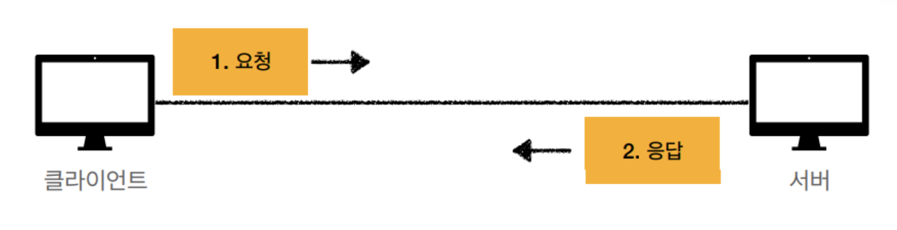

# HTTP Request Methods
- 클라이언트가 웹서버에게 요청하는 목적 및 그 종류를 알리는 수단을 말한다.

### HTTP란?
**Hyper Text Transfer Protocol**
- 서버와 클라이언트가 서로 데이터를 주고받기 위해 사용되는 통신규약.
- html, text, image, json, xml ...등 거의 모든 형태의 데이터가 전송가능하다.
- 서버간에 데이터를 주고 받을 때 대부분 HTTP라는 프로토콜을 사용해서 통신한다고 보면 된다.

#### HTTP의 통신 구조

- `클라이언트와 서버로 나뉘어진 구조`로 되어있다.
- 클라이언트와 서버를 분리해야만할까? => 각자의 역할에 집중할 수 있기 때문. 
- 클라이언트와 서버를 독립적으로 구분한다는 것은 각자의 책임을 나눠 해당 책임에만 집중하여, 클라이언트와 서버 양쪽이 각각 독립적이고 고도화 할 수 있다는 것이다.

#### HTTP의 무상태성 (Stateless)
- 무상태: 클라이언트와 서버 사이에 상태를 유지하지 않는다.
- 장점: 서버 확장성 높음 (Scale out)
- 단점: 클라이언트가 추가 데이터 전송

#### 상태유지(Stateful)
- 서버가 클라이언트의 상태를 보존한다.
- ex. 홈페이지에서 회원 로그인을 하면, 페이지를 옮겨가도 서버는 클라이언트의 상태를 보존하기 때문에 그 클라이언트가 회원인지 안다.
- 중간에 서버가 장애나면 클라이언트는 처음부터 작업을 요청해야되는데, 서버가 바뀔때마다 클라이언트의 내용을 기록해서 상태를 유지해야되는데 쉽지 않다.

#### 무상태(Stateless)
- 서버가 클라이언트의 상태를 보존하지 않는다.
- 무상태 환경에선 회원 정보를 서버가 아닌 클라이언트가 토큰 형태로 들고 있으면서, 서버와 통신할때 실어 보내 인증하는 식이디ㅏ.
- 무상태 환경은 클라이언트가 상태 정보를 갖고 있는 것이기 때문에, 아무 서버나 호출해도 되기 때문에 서버의 스케일아웃(수평확장)에 유리하다.
- `상태유지보다 데이터를 더 많이 사용한다는 단점이 있다.`

#### 비연결성(Connectionless)
- HTTP는 기본이 연결을 유지하지 않는 모델이다.
- `서버와 클라이언트이 Connection 연결을 지속하지 않는다.`

**연결을 유지하는 모델**
- 연결을 유지한다면, 자원이 계속해서 사용된다.

**연결을 유지하지 않는 모델**
- 서버의 자원을 효율적으로 사용할 수 있다.
- 클라이언트가 연결을 계속 끊는 다는 것은 TCP/IP 연결을 매번 새롭게 맺어야 한다는 것을 뜻한다.
- `TCP 3 way handshake를 매번 해야하고, 이는 시간이 걸린다.` => HTTP 지속 연결로 문제 해결하고 있다.

---

### Get
- 리소스 조회 (READ)
- 쿼리스트링 외에 메시지 바디를 사용해서 데이터를 전달할 수 있지만, 서버에서 따로 구성해야 되기 때문에 지원하지 않는 곳이 많아 권장하지 않음.
- 조회할 때 POST도 사용할 수 있지만, `GET 메서드는 캐싱이 가능`하기 때문에 GET을 사용하는 것이 유리하다.

### Post
- 요청 데이터 처리, 주로 데이터 등록에 사용 (Create)
- 메시지 바디를 통해 서버로 요청 데이터를 전달하면 서버는 요청 데이터를 처리하여 업데이트
- 만일 데이터를 GET하는 데 있어, JSON으로 조회 데이터를 넘겨야 하는 애매한 경우 POST를 사용
- 전달된 데이터로 주로 신규 리소스 등록, 프로세스 처리에 사용
- 신규 자원 생성은 200이나 201로 응답을 보냄. (201 - Created)

[Content-Type 헤더 종류]
- application/x-www-form-unlencoded : Form의 내용을 HTTP 메시지 바디를 통해서 전송 (key=value, 쿼리 파라미터 형식)
- multipary/form-data : 파일 업로드 같은 바이너리 데이터 전송 시 사용
- application/json : TEXT, XML, JSON 데이터 전송 시 사용

### PUT
- 리소스를 대체, 해당 리소스가 없으면 생성(Update)
- 만일 요청 메세지에 리소스가 있으면 덮어쓰고, 없으면 새로 생성한다.
- 데이터를 대체해야 하니, 클라이언트가 리소스의 구체적인 전체 경로를 지정해 보내주어야 한다.
- 일부 리소스만 변경하길 원할 경우에는 해당 데이터를 PUT으로 전달한다. 이때, 기존 데이터가 `완전히 대체되어 기존에 있던 다른 데이터들도 삭제된다. 이때는 PATCH 메소드를 이용해야 한다.`

### PATCH
- 리소스를 일부만 변경(Update)
- 만일 PATCH를 지원하지 않는 서버에서는 대신에 POST를 사용할 수 있다.

### DELETE
- 리소스 삭제(Delete)
- 상태코드는 대부분 200을 사용하고 상황에 따라 204를 사용한다.

### HEAD
- GET과 동일하지만 메시지 부분을 제외하고, 상태 줄과 헤더만 반환
- GET과 동일하지만 서버에서 Body를 Return하지 않음.
- 응답 상태 코드만 확인할때와 같이 Resource를 받지 않고 오직 찾기만 원할때 사용

### TRACE
- 대상 리소스에 대한 경로를 따라 메시지 루프백 테스트를 수행
- 서버에 도달 했을 때의 최종 패킷의 요청 패킷 내용을 응답 받을 수 있다.
- 요청의 최종 수신자는 반드시 송신자에게 200(OK) 응답의 내용(Body)로 수신한 메세지를 반송해야 한다.
- 클라이언트의 요청 패킷이 방화벽, Proxy 서버, Gateway 등을 거치면서 패킷의 변조가 일어날 수 있는데, 그래서 TRACE 메서드를 통해 요청했던 패킷 내용과 응답 받은 요청 패킷 내용을 비교하여 변조 유무를 확인할 수 있다.

### OPTIONS
- 대상 리소스에 대한 통신 기능 옵션을 설명(주로 CORS에서 사용)
- 예비 요청(Preflight)에 사용되는 HTTP 메소드
- 예비 요청이란 본 요청을 하기 전에 안전한지 미리 검사하는 것이라고 보면 된다.

### CONNECT
- 대상 자원으로 식별되는 서버에 대한 터널을 설정

- UDP를 이용한 QUIC 프로토콜?

---
#### 참고 자료
- [HTTP는 무엇일까요?](https://inpa.tistory.com/entry/HTTP-%F0%9F%8C%90-%EB%B0%B1%EC%97%94%EB%93%9C-%EB%A1%9C%EB%93%9C%EB%A7%B5-HTTP%EB%8A%94-%EB%AC%B4%EC%97%87%EC%9D%BC%EA%B9%8C%EC%9A%94)
- [Stateful vs Stateless 정리](https://inpa.tistory.com/entry/WEB-%F0%9F%93%9A-Stateful-Stateless-%EC%A0%95%EB%A6%AC)
- [HTTP 메시지 종류 및 통신 과정 총정리](https://inpa.tistory.com/entry/WEB-%F0%9F%8C%90-HTTP-%EB%A9%94%EC%84%9C%EB%93%9C-%EC%A2%85%EB%A5%98-%ED%86%B5%EC%8B%A0-%EA%B3%BC%EC%A0%95-%F0%9F%92%AF-%EC%B4%9D%EC%A0%95%EB%A6%AC)
